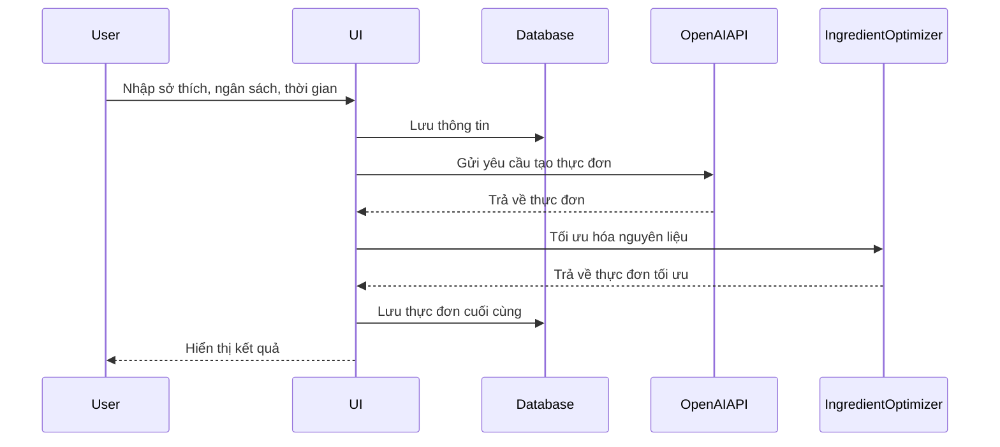
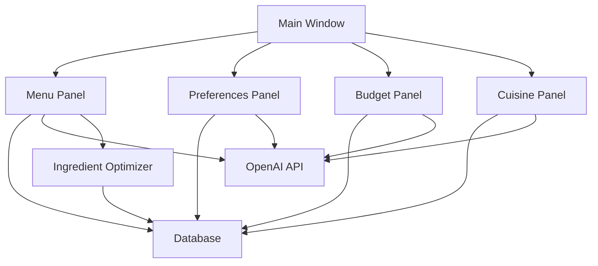
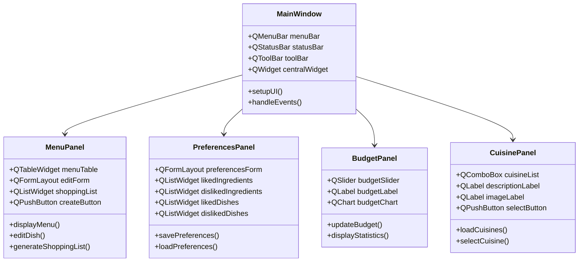
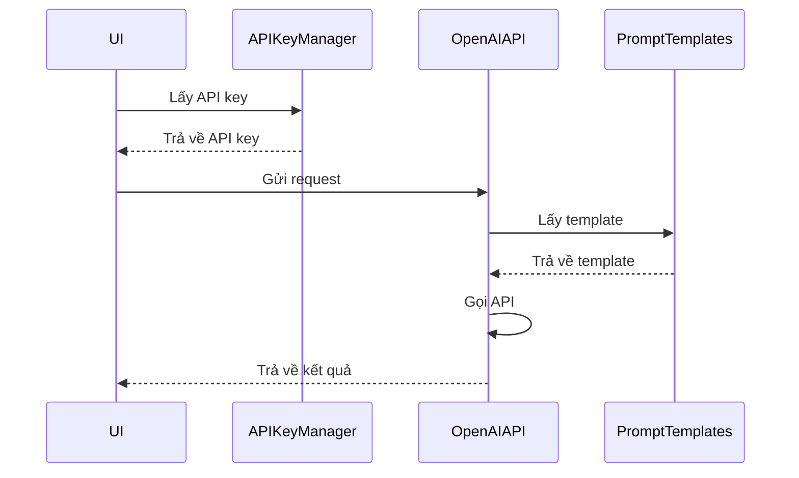
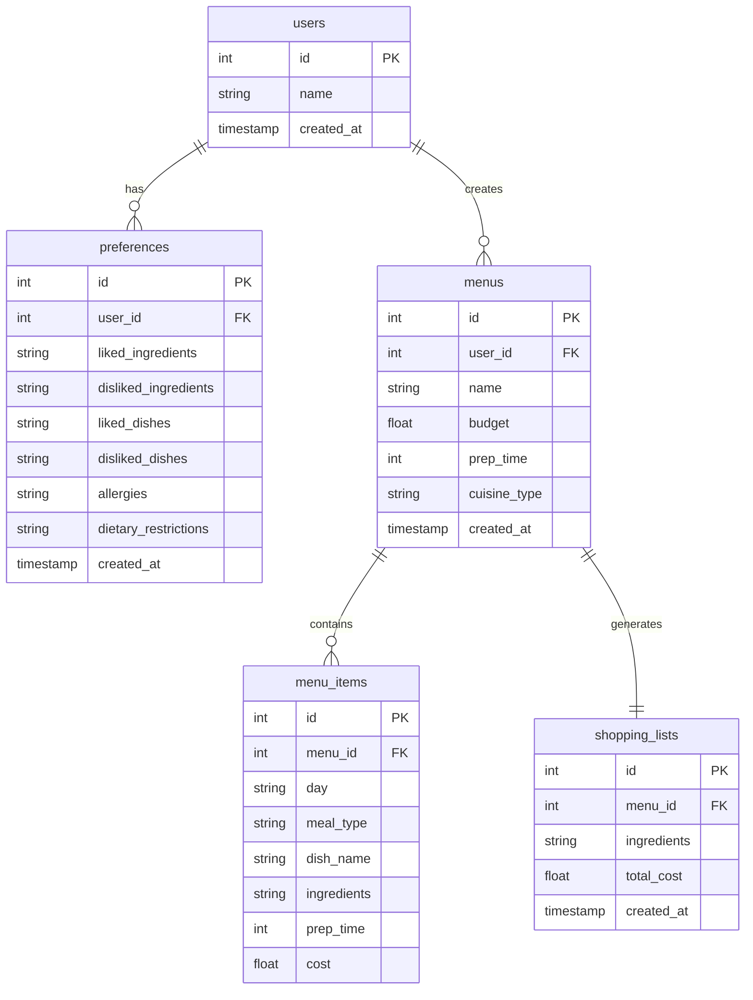
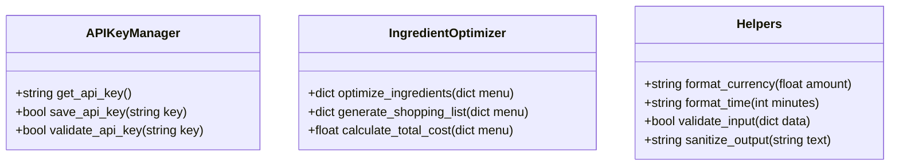

# Tài liệu thiết kế kỹ thuật - Ứng dụng Lên Thực Đơn Tuần

## 1. Tổng quan

Ứng dụng Lên Thực Đơn Tuần là một ứng dụng desktop được phát triển bằng Python, sử dụng PyQt5 cho giao diện người dùng và OpenAI API để tạo thực đơn thông minh. Ứng dụng giúp người dùng lập kế hoạch thực đơn tuần dựa trên sở thích cá nhân, ngân sách và thời gian chuẩn bị.

## 2. Kiến trúc hệ thống

### 2.1. Cấu trúc thư mục
```
LenThucDonTuan/
├── api/                 # Xử lý API và prompts
├── database/           # Quản lý database
├── ui/                 # Giao diện người dùng
├── utils/              # Các tiện ích hỗ trợ
├── main.py            # Điểm khởi đầu ứng dụng
├── config.py          # Cấu hình ứng dụng
└── requirements.txt    # Các dependencies
```

### 2.2. Luồng dữ liệu


### 2.3. Kiến trúc tổng thể


## 3. Các thành phần chính

### 3.1. Giao diện người dùng (UI)


### 3.2. Xử lý API


### 3.3. Database


### 3.4. Tiện ích


## 4. Công nghệ sử dụng

- Python 3.8+
- PyQt5: Giao diện người dùng
- SQLite: Database
- OpenAI API: Tạo thực đơn thông minh
- Cryptography: Mã hóa API key

## 5. Bảo mật

- API key được mã hóa và lưu trữ an toàn
- Dữ liệu người dùng được lưu trữ cục bộ
- Không có thông tin nhạy cảm nào được gửi lên server

## 6. Hiệu suất

- Sử dụng caching cho các request API
- Tối ưu hóa database queries
- Xử lý bất đồng bộ cho các tác vụ nặng

## 7. Mở rộng

- Dễ dàng thêm các phong cách ẩm thực mới
- Có thể tích hợp thêm các API khác
- Hỗ trợ đa ngôn ngữ 